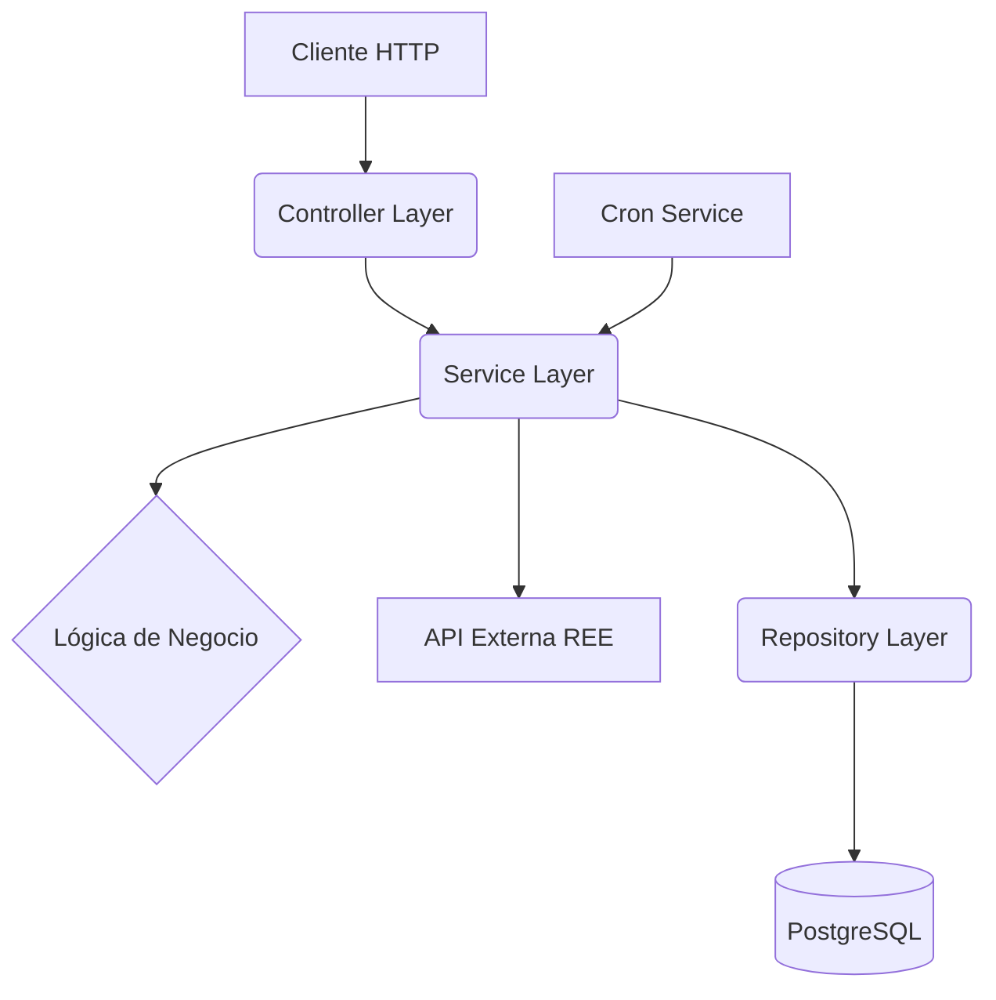

# 🚀 Balance Eléctrico - Backend

API RESTful para la gestión y consulta de datos del balance eléctrico nacional de España (datos de REE - Red Eléctrica de España).

## 📋 Tabla de Contenidos

- [Descripción General](#-descripción-general)
- [Tecnologías](#-tecnologías)
- [Estructura del Proyecto](#-estructura-del-proyecto)
- [Configuración y Ejecución](#-configuración-y-ejecución)
- [Arquitectura y Flujo de Datos](#-arquitectura-y-flujo-de-datos)
- [API Endpoints](#-api-endpoints)
- [Testing](#-testing)
- [Desarrollo](#-desarrollo)

---

## 🎯 Descripción General

Este backend proporciona una API robusta y escalable para:

- 💾 **Almacenar y servir** datos históricos del balance eléctrico.
- 🔄 **Actualizar datos** bajo demanda desde la API de REE.
- ⚙️ **Procesar y agregar** datos para consultas complejas.
- 📈 **Ofrecer endpoints** optimizados para visualizaciones en el frontend.

### Stack Tecnológico

- **NestJS** - Framework Node.js progresivo para construir aplicaciones eficientes y escalables.
- **TypeScript** - Type safety y desarrollo robusto.
- **TypeORM** - ORM para TypeScript y JavaScript.
- **PostgreSQL** - Base de datos relacional de código abierto.
- **Docker & Docker Compose** - Para un entorno de desarrollo y despliegue consistente.
- **PNPM** - Gestor de paquetes rápido y eficiente.

---

## 📁 Estructura del Proyecto

```
backend/
├── src/
│   ├── config/               # Configuración de la aplicación (e.g., TypeORM)
│   ├── core/                 # Lógica de negocio central y entidades base
│   ├── database/             # Migraciones y configuración de la BD
│   ├── modules/
│   │   └── balance/          # Módulo principal de la aplicación
│   │       ├── dto/          # Data Transfer Objects para validación
│   │       ├── entities/     # Entidades TypeORM
│   │       ├── transformers/ # Transformadores de datos
│   │       ├── balance.controller.ts # Endpoints de la API
│   │       ├── balance.service.ts    # Lógica de negocio
│   │       ├── balance.repository.ts # Capa de acceso a datos
│   │       ├── balance.cron.service.ts # Tareas programadas
│   │       └── balance.module.ts     # Definición del módulo
│   │
│   ├── utils/                # Utilidades y helpers
│   ├── app.module.ts         # Módulo raíz de la aplicación
│   └── main.ts               # Entry point de la aplicación
│
├── test/                     # Tests e2e
├── Dockerfile                # Definición del contenedor
├── docker-entrypoint.sh      # Script de inicio para Docker
├── nest-cli.json             # Configuración de NestJS CLI
├── package.json              # Dependencias y scripts
└── tsconfig.json             # Configuración de TypeScript
```

---

## ⚙️ Configuración y Ejecución

### Requisitos Previos

- **Node.js** >= 18.0.0
- **pnpm** (recomendado)
- **Docker** y **Docker Compose**

### Instalación

```bash
# Navegar al directorio del backend
cd backend/

# Instalar dependencias
pnpm install
```

### Configuración de Entorno

Crea un archivo `.env` en la raíz de `/backend` a partir del ejemplo `.env.example` (si existe) o con las siguientes variables:

```env
# .env
DB_HOST=db
DB_PORT=5432
DB_USERNAME=postgres
DB_PASSWORD=postgres
DB_DATABASE=balance_db
```

### Ejecución con Docker (Recomendado)

La forma más sencilla de levantar todo el stack (backend + DB) es usando Docker Compose desde la raíz del repositorio.

```bash
# Desde la raíz del proyecto
docker-compose up --build
```

El backend estará disponible en `http://localhost:3000`.

### Ejecución Local (Sin Docker)

```bash
# Modo desarrollo con watch
pnpm run start:dev
```

---

## 🏗️ Arquitectura y Flujo de Datos

El backend está construido con una arquitectura modular y en capas:

1.  **Controller Layer** (`balance.controller.ts`): Expone los endpoints HTTP, valida las peticiones (DTOs) y delega la lógica al servicio.
2.  **Service Layer** (`balance.service.ts`): Contiene la lógica de negocio principal. Orquesta las llamadas a la API externa (REE), procesa los datos y se comunica con la capa de repositorio.
3.  **Repository Layer** (`balance.repository.ts`): Abstrae el acceso a la base de datos usando TypeORM. Proporciona métodos para consultar y manipular las entidades.
4.  **Cron Service** (`balance.cron.service.ts`): Gestiona tareas programadas, como la actualización periódica de datos.



---

## 🔌 API Endpoints

Prefijo base: `/api/v1`

### Módulo `Balance`

- **`GET /balance`**: Obtiene registros de balance. Permite filtros por rango de fechas, tipo, subtipo y agrupación temporal.
  - **Query Params**: `startDate`, `endDate`, `type`, `subtype`, `time_grouping`

- **`GET /balance/categorized`**: Obtiene datos de balance agregados por categoría y subcategoría.
  - **Query Params**: `startDate`, `endDate`

- **`GET /balance/refresh`**: Dispara una actualización manual de los datos desde la API de REE para un rango de fechas.
  - **Query Params**: `start_date`, `end_date`

- **`GET /balance/:id`**: Obtiene un registro de balance por su ID.

- **`DELETE /balance/:id`**: Elimina un registro de balance por su ID.

---

## 🧪 Testing

### Stack de Testing

- **Jest**: Test runner.
- **Supertest**: Para tests e2e de los endpoints HTTP.

### Ejecutar Tests

```bash
# Ejecutar tests unitarios
pnpm run test

# Ejecutar tests e2e
pnpm run test:e2e

# Generar reporte de cobertura
pnpm run test:cov
```

---

## 🛠️ Desarrollo

### Scripts Disponibles

```json
{
  "start": "nest start",
  "start:dev": "nest start --watch",
  "start:prod": "node dist/main",
  "test": "jest",
  "test:e2e": "jest --config ./test/jest-e2e.json",
  "test:cov": "jest --coverage"
}
```

### Migraciones (Desarrollo Local)

```bash
# Generar una nueva migración
pnpm run migration:generate -- src/database/migrations/NewMigrationName

# Ejecutar migraciones pendientes
pnpm run migration:run

# Revertir la última migración
pnpm run migration:revert
```
